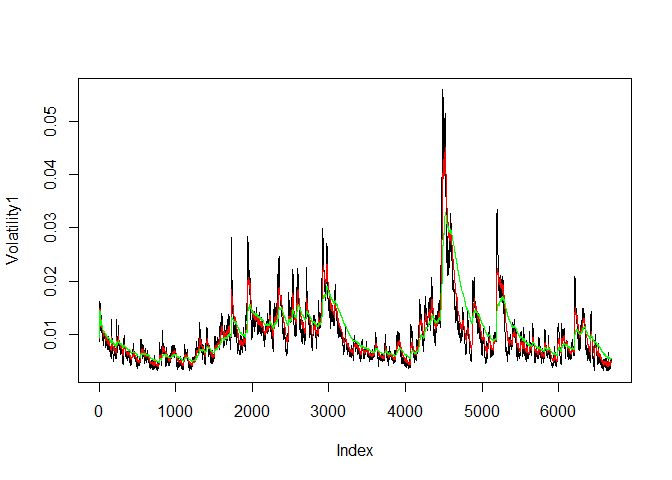

# Unit 11 BLT Assignment
Rangaswamy Nagarajan  
July 18, 2017  


## Analysis


```r
library(tseries)
```

```
## Warning: package 'tseries' was built under R version 3.4.1
```

```r
SandP500 <- get.hist.quote('^gspc',quote = "Close")
```

```
## 'getSymbols' currently uses auto.assign=TRUE by default, but will
## use auto.assign=FALSE in 0.5-0. You will still be able to use
## 'loadSymbols' to automatically load data. getOption("getSymbols.env")
## and getOption("getSymbols.auto.assign") will still be checked for
## alternate defaults.
## 
## This message is shown once per session and may be disabled by setting 
## options("getSymbols.warning4.0"=FALSE). See ?getSymbols for details.
```

```
## 
## WARNING: There have been significant changes to Yahoo Finance data.
## Please see the Warning section of '?getSymbols.yahoo' for details.
## 
## This message is shown once per session and may be disabled by setting
## options("getSymbols.yahoo.warning"=FALSE).
```

```
## time series ends   2017-07-14
```

```r
## Log returns
SandPlog <- log(lag(SandP500))-log(SandP500)
head(SandPlog)
```

```
##                   Close
## 1991-01-02 -0.014004819
## 1991-01-03 -0.002830893
## 1991-01-04 -0.017472627
## 1991-01-07 -0.001713387
## 1991-01-08 -0.010887906
## 1991-01-09  0.009712255
```

```r
tail(SandPlog)
```

```
##                    Close
## 2017-07-06  0.0063827127
## 2017-07-07  0.0009273361
## 2017-07-10 -0.0007829873
## 2017-07-11  0.0072790511
## 2017-07-12  0.0018728294
## 2017-07-13  0.0046626164
```

```r
## Volatility measure
SandPvol <- sd(SandPlog)* sqrt(250)*100
SandPvol
```

```
## [1] 17.72151
```

```r
## Volatility over entire length of series for various three different decay factors.
Volatility <- function(d,logrets){
  var = 0
  lam = 0
  varlist <- c()
  for (r in logrets){
    lam = lam *(1-1/d)+1
    var = (1-1/lam)*var +(1/lam)*r^2
    varlist <- c(varlist,var)
  }
  sqrt(varlist)
}
Volatility1 <- Volatility(10,SandPlog)
Volatility2 <- Volatility(30,SandPlog)
Volatility3 <- Volatility(100,SandPlog)
```

## Plot with volatility curves

```r
plot(Volatility1,type = "l")
lines(Volatility2,type = "l",col="red")
lines(Volatility3,type = "l",col="green")
```

<!-- -->
